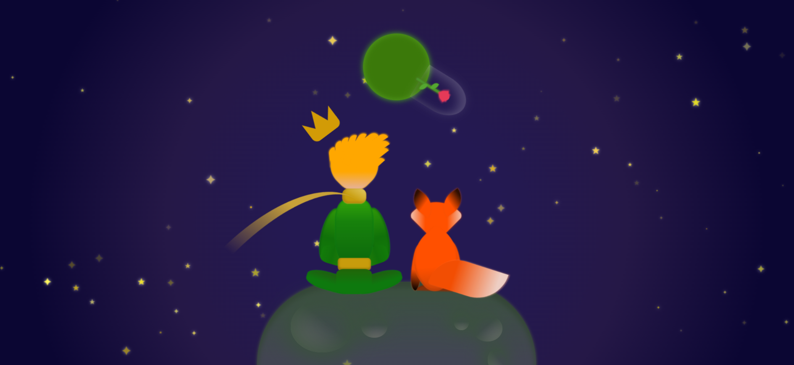

# 🌟 Príncipe & Raposa – Animação inspirada em *O Pequeno Príncipe*




Este projeto é uma animação criada apenas com **HTML, SCSS e JavaScript**, inspirada no universo poético de *O Pequeno Príncipe*.  
O cenário conta com uma **flor em uma redoma, um planeta**, o **Príncipe**, a **Raposa**, além de elementos animados como **estrelas**, **planeta giratório**, **lenço**, **cabelo**, entre outros.

Tudo foi feito **usando apenas CSS (SCSS) para desenhos, sombras, formas e animações**, sem uso de imagens para os personagens.

---

## 🎨 Demonstração

(Adicione aqui o link do deploy, se você publicar em Vercel, Netlify ou GitHub Pages)

---

## 🧩 Estrutura do Projeto

📁 projeto-principe-raposa
├── index.html
├── styles.css (gerado a partir do SCSS)
├── script.js
├── fox-icon.png
└── README.md

---

## 🚀 Tecnologias Utilizadas

- **HTML5**
- **SCSS (CSS avançado)**
- **CSS Animations & Keyframes**
- **JavaScript**
- **Ionicons**

---

## ✨ Destaques do Projeto

✔ Desenhos completos usando apenas CSS  
✔ Animações suaves (flores, estrelas, planeta, lenço, cabelos etc.)  
✔ Paleta de cores inspirada no universo de Saint-Exupéry  
✔ Estrutura organizada com BEM e SCSS  
✔ Personagens montados com divs e gradientes  
✔ Atmosfera imersiva com céu estrelado e planeta giratório  

---

## 🛠 Como executar o projeto

1. Baixe ou clone o repositório:
```bash
git clone https://github.com/seuusuario/principe-raposa.git
```

2. Abra o arquivo:

index.html

O projeto roda direto no navegador, sem necessidade de servidor local.

# ✨ Veja mais projetos como este

Estou sempre criando animações, interfaces e projetos experimentais.
Você pode ver outros trabalhos no meu CodePen:

👉 CodePen: https://codepen.io/SEU-USUARIO-AQUI


## 📬 Contato

Se quiser trocar ideias, colaborar ou fazer indicações, estou disponível:

- LinkedIn: https://www.linkedin.com/in/douglasdgprogdev

- Portfólio: https://dgaraujo-dev.vercel.app/

💛 “Tu te tornas eternamente responsável por aquilo que cativas.”